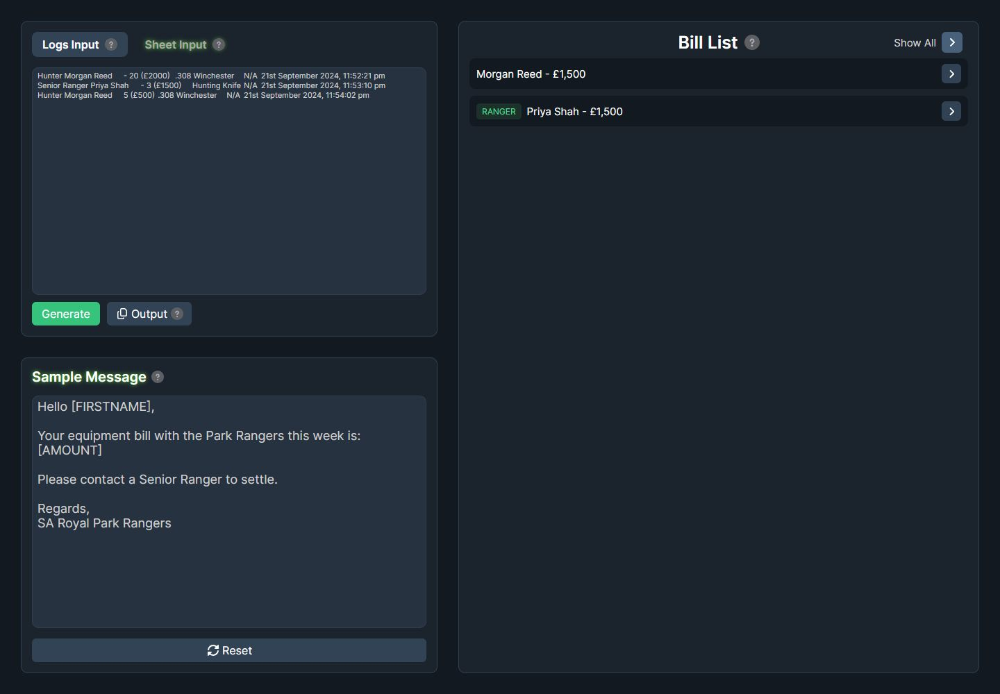

<h1 align="center">RPUK Park Ranger Bills Helper</h1>

  
  
  

  
  
  
  
  

A browser tool for turning Roleplay UK Park Ranger equipment logs into weekly bills, spreadsheet rows, phone contacts, and ready-to-copy messages.

[Open the live website](https://git.finnley.co.uk/rpuk-park-ranger-bills/)

## Preview

## Workflow

1. Paste tab-separated armoury logs into **Logs Input**.
2. Select **Generate** to total every person's bill and item changes.
3. Copy the generated name and bill rows into the Ranger spreadsheet.
4. Copy the spreadsheet's name, bill, active-days, and phone columns back into **Sheet Input**.
5. Generate contact buttons and personalised messages.
6. Use the bill list to copy phone numbers and messages while working through the results.

## Log input format

The parser uses the first three tab-separated columns:

| Column | Example |
| --- | --- |
| Rank and name | `Hunter Morgan Reed` |
| Quantity and value | `- 20 (£2000)` |
| Item | `.308 Winchester` |

A complete row can contain additional columns, but the first three must be present.

Positive and negative values are used to calculate whether items were taken or returned. Bills at or below zero are removed, except the combined Hunting Shack and Jobs entries.

## Sheet input format

Paste four tab-separated spreadsheet columns in this order:

~~~text
Name    Bill    Days active    Phone number
~~~

The current code reads the name, bill, and fourth column. The days-active value is accepted as the third column but is not otherwise used.

The sample message supports:

- `[FIRSTNAME]`, replaced with the first word of the person's name.
- `[AMOUNT]`, replaced with their bill value.

## Features

- Totals multiple log entries for each person.
- Separates taken and returned item quantities.
- Shows per-item cost changes.
- Labels Rangers separately from hunters.
- Groups anonymous logs under Hunting Shack.
- Groups photography and culling entries under Jobs.
- Copies spreadsheet output, phone numbers, and messages.
- Highlights the last phone number or message copied.
- Includes tooltips for each stage.

## Development

The maintained website is under `Website/`.

~~~bash
cd Website
pnpm install
pnpm dev
~~~

Quality checks and production build:

~~~bash
pnpm lint
pnpm build
pnpm preview
~~~

The GitHub Pages workflow publishes `Website/dist`. It does not build the React source in CI, and it only runs automatically when committed files under `Website/dist/` change. Build locally before committing a deployment update.

## Repository layout

- `Website/src/`, maintained React and TypeScript application.
- `Website/dist/`, committed static build deployed to GitHub Pages.
- `Old Website/`, previous HTML, CSS, and JavaScript version.
- `Executable/`, older Python and Windows executable workflow.
- `docs/screenshot.jpg`, README preview.

## Legacy versions

The files under `Old Website/` and `Executable/` are kept for reference and are not the recommended version. New fixes should target `Website/src/`.

## Known limitations

- Input depends on exact tab-separated columns from the game and spreadsheet.
- Invalid or changed log formats have limited validation.
- The layout is designed for desktop use.
- Contact information is processed in the browser. Avoid committing real logs, phone numbers, or spreadsheet exports.
- The generated messages still require a person to review and send them.

## Licence

No project-level licence is currently included. Roleplay UK names and game-related material belong to their respective owners.
